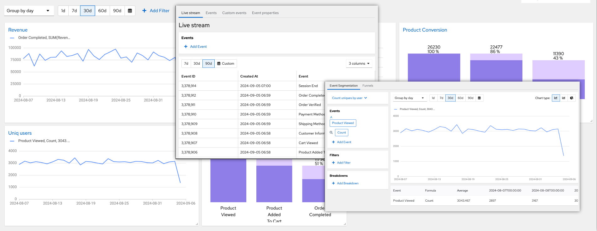

# Optiprism

Optiprism is an opensource self-hosted product analytics system. Keep customer data safe on your own servers. Analyze and predict customer behavior.
Optimize your product and increase users engagement.



# Features

- Event segmentation
- Funnel Analysis
- Events stream
- User profiles
- Group analytics
- HTTP ingester
- Backups
- Organization and project based access
# Roadmap

- Replication
- Sharding
- Retention
- Cohorts
- Segments

# How to run with Docker

1. Run docker container with demo dataset
```
docker run -p 8080:8080 docker.io/optiprismio/optiprism:v0.7.3 store --demo-data-path=/var/lib/optiprism/init/demo --generate --config=/etc/optiprism/config.d/config.toml
```

2. Check the UI http://localhost:8080

# How to install with Helm
1. Configure `helm/values.yaml` (setup ingress host and set storage class if needed)
2. Apply: ```helm upgrade --install --values ./helm/optiprism/values.yaml optiprism ./helm/optiprism/ -n optiprism``` 
3. Check the UI http://your-host
# Frontend

https://github.com/optiprism-io/frontend