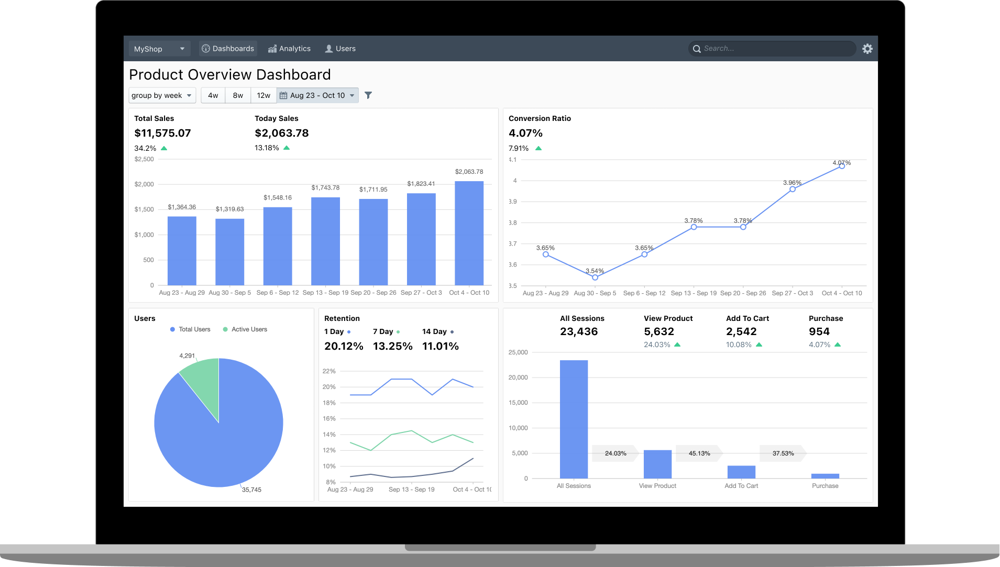

# Optiprism

Optiprism is an opensource self-hosted product analytics system. Keep customer data safe on your own servers. Analyze and predict customer behavior.
Optimize your product and increase users engagement.

# Roadmap

- Analytics
  - [ ] Event segmentation
  - [ ] Funnels
  - [ ] Retention
  - [ ] User Paths
  - [ ] Stickiness
  - [ ] Lifecycle
  - [ ] Heatmaps
  - [ ] Correlation
  - [ ] Prediction
  - [ ] Feature flags
  - [ ] Annotations / Releases
- [ ] Dashboards
- [ ] Groups
- [ ] Cohorts
- [ ] Projects
- [ ] Teams
- [ ] Permissions
- [ ] SSO
- Data sources
  - [ ] JS tracker
  - [ ] iOS SDK
  - [ ] Android SDK
- Processors
  - [ ] Geo enrichment 
  - [ ] Device enrichment
- Destinations
  - [ ] Local store
  - [ ] GCloud
  - [ ] AWS
  - [ ] Azure
- Storage
  - [ ] Replication
  - [ ] Backups