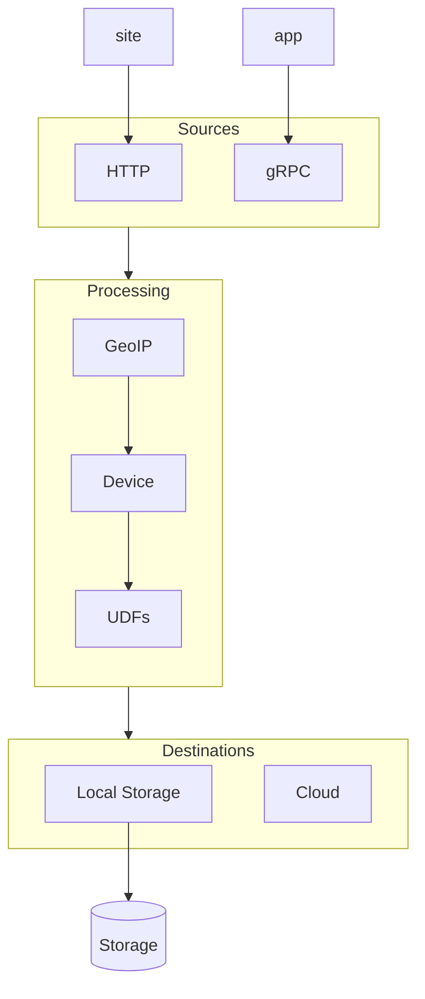

```json
{
	"user_id": "qwe123", // required
	"created_at": "2015-12-12T19:11:01.169Z", // optional, timestamp
	"context": { // optional
		"library": {
			"name": "analytics.js",
			"version": "2.11.1"
		},
		"page": { // optional
			"location": "https://myshop.com/search/?tv",
			"referrer": "https://google.com",
			"title": "Search Products"
		},
		"browser": { // optional
			"user_agent": "Mozilla/5.0 (Windows NT 10.0; Win64; x64) AppleWebKit/537.36 (KHTML, like Gecko) Chrome/98.0.4758.102 Safari/537.36",
			"device_memory": 8,
			"screen_width": 2560,
			"screen_height": 1440,
			"client_hints": { // optional
				"architecture": "x86",
				"bitness": "64",
				"brand": "Google Chrome",
				"brand_version": "98.0.4758.102",
				"mobile": false,
				"model": "",
				"platform": "Windows",
				"platform_version": "10.0.0"
			}
		},
		"app": { // optional
			"id": "com.whatsapp"
		},
		"ip": "101.10.8.21"
	},
	"event": "Buy Product", // required
	"properties": { // optional, HashMap<String, PropertyValue>
		"Product Name": "Samsung TV", // arbitrary property name and value
		"Product Size": 60,
		"HDR": true,
		"Price": 899
	}
}
```
